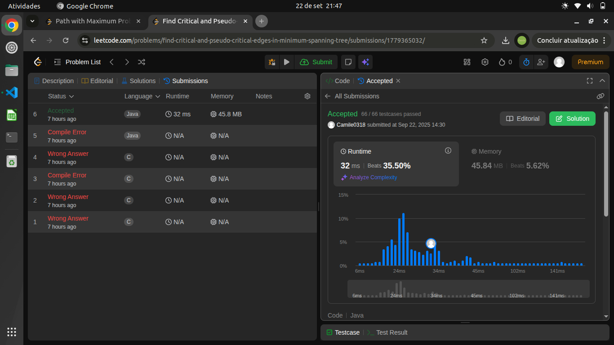
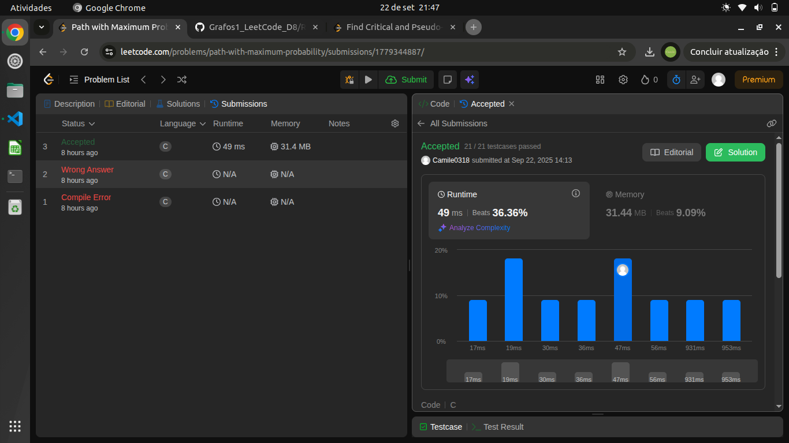
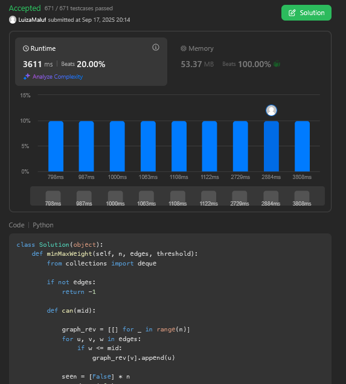
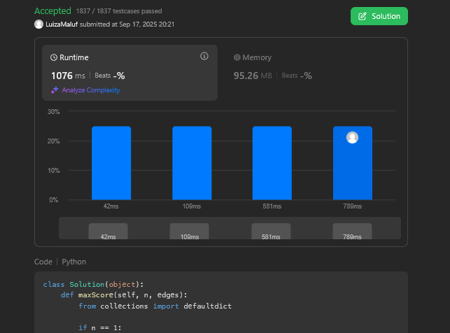

# Grafos2_LeetCode_D8

Repositório da Dupla 08 do semeste 2025.2.

**Conteúdo:** Gráfos 2.

## Alunos

| Matrícula | Aluno |
|-----------|-------|
| 25/1035022 | Camile Barbosa Gonzaga De Oliveira |
| 22/1008294 | Luiza Maluf Amorim |

## Objetivo

Desenvolver questões em que possamos explorar nossos conhecimentos desenvolvidos em sala de aula sobre o assunto Grafos 2.

## Instalação

- **Linguagem**: Python e C.

## Exercícios

|Código do Problema| Nome do Problema | Resolução | Dificuldade
|----------|----------|----------|----------|
|1489| [Find critical and pseudo-critical edges in minimum spanning tree](https://leetcode.com/problems/find-critical-and-pseudo-critical-edges-in-minimum-spanning-tree/description/)|assets/1489.png|Difícil|
|1514|[Path with Maximum Probability](https://leetcode.com/problems/path-with-maximum-probability/description/)|assets/1514.png|Médio|
|3419|[Minimize the maximum edge weight of graph](https://leetcode.com/problems/minimize-the-maximum-edge-weight-of-graph)|assets/3419.png|Médio|
|3547|[Maximum sum of edge values in a graph](https://leetcode.com/problems/maximum-sum-of-edge-values-in-a-graph)|assets/3547.png|Difícil|

## Apresentação

[Link para a apresentação]

## Screenshots
### 1489
<center>



</center>

### 1514

<center>



</center>


### 3419




### 3547



## Pré-requisitos

### Python
- Ter o [Python 3](https://www.python.org/downloads/) instalado na máquina.  
- (Opcional) Criar e ativar um ambiente virtual:
  ```bash
  python3 -m venv venv
  source venv/bin/activate   # Linux/Mac
  venv\Scripts\activate      # Windows
  ```

### C
- Ter um compilador C instalado . O GCC (GNU Compiler Collection) é o mais utilizado e ele já vem pré-instalado em muitos sistemas operacionais (como Linux e macOS).
- Se você estiver no Windows e precisar instalar o GCC, pode considerar o uso do MinGW ou do Cygwin.

- (Opcional) Acessar um compilador C online para escrever, compilar e executar o código diretamente no navegador.

## Como rodar

### Python 

Para executar uma solução específica:

 ```bash
 python nome_do_arquivo.py
 ```

### C

 ```bash
gcc nome_do_arquivo.c
./a.out 
 ```
